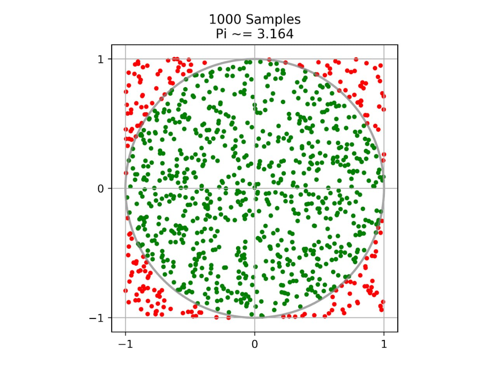

# Sixth Assignment: Advanced Multithreading

## Table of contents
- [Important Note](#important-note)
- [Introduction](#introduction)
- [Objectives 🎯](#objectives-)
- [Theoretical Questions 📝](#theoretical-questions-)
- [Practical Questions 💻](#practical-questions-)
- [Bonus Tasks 🌟](#bonus-tasks-)
- [Evaluation ⚖️](#evaluation-)
- [Submission ⌛](#submission-)
- [Additional Resources 📚](#additional-resources-)


## Important Note:
This project is configured to use a **local Gradle installation**. If you're opening this project on your own system, please make sure to:

1. Go to **Settings/Preferences** > **Build, Execution, Deployment** > **Build Tools** > **Gradle**.

2. Under **Gradle settings**, change the **Gradle distribution** to:

- **Use local Gradle distribution**, and

- Set the **Gradle home** path to your own local Gradle installation directory.

If you don’t have Gradle installed locally, you can either:

- Install Gradle manually and configure the path, or

- Change the setting to **Use Gradle wrapper** instead.


## Introduction
Welcome to your Sixth Advanced Programming (AP) Assignment. This project is divided into two main sections:

1. **Theoretical Questions**: This section is designed to deepen your understanding of advanced multithreading concepts in Java. You'll have to analyze two code blocks and answer questions about them.

2. **Practical Questions**: In this section, you'll get hands-on experience with multithreading in Java. Your code will be manually checked to ensure you've implemented the tasks using multithreading.


## Objectives 🎯

By completing this assignment, you will:

- Deepen your understanding of **multithreading** in Java and apply the concepts effectively.
- ...

...

## Theoretical Questions 📝
**Note: Please answer these questions in a Markdown file (Report.md) and place it in the root directory of your fork. Include code or screenshots where you see fit.**

### 1. `Atomic Variables`

```java  
import java.util.concurrent.atomic.AtomicInteger;
public class AtomicDemo {
  private static AtomicInteger atomicCounter = new AtomicInteger(0);
  private static int normalCounter = 0;
  public static void main(String[] args) throws InterruptedException {
    Runnable task = () -> {
      for (int i = 0; i < 1_000_000; i++) {
        atomicCounter.incrementAndGet();
        normalCounter++;
      }
    };

    Thread t1 = new Thread(task);
    Thread t2 = new Thread(task);
    t1.start();
    t2.start();
    t1.join();
    t2.join();

    System.out.println("Atomic Counter: " + atomicCounter);
    System.out.println("Normal Counter: " + normalCounter);
  }
}
  
```  

**Questions:**

- What output do you get from the program? Why?

- What is the purpose of AtomicInteger in this code?

- What thread-safety guarantees does atomicCounter.incrementAndGet() provide?

- In which situations would using a lock be a better choice than an atomic variable?

- Besides AtomicInteger, what other data types are available in the java.util.concurrent.atomic package?

---  

### 2. `Callable` and `Future`

```java  
import java.util.ArrayList;
import java.util.List;
import java.util.concurrent.*;

public class CallableFutureExample {
  private static long factorial(int n) {
    long result = 1;
    for (int i = 2; i <= n; i++) result *= i;
    return result;
  }

  static class FactorialTask implements Callable<Long> {
    private final int number;

    public FactorialTask(int number) {
      this.number = number;
    }

    @Override
    public Long call() throws Exception {
      return factorial(number);
    }
  }

  public static void main(String[] args) {
    ExecutorService executor = Executors.newFixedThreadPool(3);
    List<Future<Long>> futures = new ArrayList<>();

    for (int i = 1; i <= 20; i++) {
      futures.add(executor.submit(new FactorialTask(i)));
    }

    for (Future<Long> future : futures) {
      try {
        long result = future.get();
        System.out.println(result);
      } catch (InterruptedException | ExecutionException e) {
        //[Handling Exceptions]
      }
    }

    executor.shutdown();
  }
}
```  

**Questions:**

- What output do you get from the program? Why?

- What is the purpose of Callable in Java, and how is it different from Runnable?

- What does Future.get() do, and what happens if the result is not yet available?

- Why do we use executor.submit() instead of execute() in this code?

- What are some real-world use cases where using Callable and Future is beneficial?
  
---


## Practical Questions 💻

### Pi (π) Estimation - Monte Carlo Algorithm




#### Task Description
The Monte Carlo algorithm for estimating π (pi) is a classic example of using
random sampling to approximate a mathematical constant.

This project simulates random points(x,y) in a 2D plane, within a square of side length
2r, centered at the origin (0,0). Inside this square, a circle of radius r is perfectly inscribed.

The simulation calculates the ratio of points that fall inside the circle to the total number of generated points.
This ratio approximates the area ratio between the circle and the square, and can be used, for example, to estimate the value of π.

- Area of Square: $(2r)^2 = 4r^2$
- Area of Circle: $4\pi r^2$
- The ratio of these two: $\frac{circle's area}{square's area} = \frac{\pi r^2}{4r^2} = \frac{\pi}{4} $

We generate random (x,y) pairs within the square domain and determine whether each point lies inside the inscribed circle using the condition:
$$x+y\leqslant 1$$
If the condition is satisfied, the point is considered inside the circle, and we increment the corresponding counter.


#### 🛠 What  You  Need to Do

1. Complete the Code:
   Implement the Monte Carlo simulation to estimate the value of π. The implementation should include both:
- A single-threaded version.

- A multi-threaded version that uses all available CPU cores.

2. Write a Brief Report (README):

- Explain how you parallelized the computation using Java threads or executor services.

- Include a comparison of performance (benchmark results) between the multi-threaded and single-threaded versions.

---

### Banking System

#### Task Description
...

#### 🛠 What  You  Need to Do

...

---  


## Bonus Tasks 🌟

- Monte Carlo
    - ...
        - ...
    - ...
        - ...
        - ...
- Banking System
    - ...
        - ...


## Evaluation ⚖️

Your work on this assignment will be evaluated based on:

- **Understanding of Multithreading Concepts**: Your ability to accurately answer the theoretical questions, and demonstrating a deep understanding of multithreading in Java. Remember that the answers to the theoretical questions should be provided separately in a markdown file.

- **Code Quality**: Your code should be well-structured, readable, and efficient. Proper use of Java conventions, including variable naming, class structure, and comments, will also be considered.

- You **must not** use advanced multithreading tools (such as ExecutorService, CompletableFuture, or others)

- Total: 100 points
    - 🧠 Theoretical Questions – 30 points
    - 💻 Practical Task 1 (Monte Carlo) – 35 points
    - 📊 Practical Task 2 (Banking System) – 35 points
    - 🌟 Bonus Tasks – Up to 10 extra points

## Submission ⌛

1. Add your mentor as a contributor to the project.
2. Create a `develop` branch for implementing features.
3. Use Git for regular code commits.
4. Push your code and the answers file to the remote repository.
5. Submit a pull request to merge the `develop` branch with `main`.

The deadline for submitting your code is **Wednesday, May 14** (24th of Ordibehesht)

## Additional Resources 📚

For assistance with this assignment, you may refer to the following resources:

- [Race Conditions and Critical Sections](https://jenkov.com/tutorials/java-concurrency/race-conditions-and-critical-sections.html)
- [Java Synchronized Blocks](https://jenkov.com/tutorials/java-concurrency/synchronized.html)
- [Deadlock](https://jenkov.com/tutorials/java-concurrency/deadlock.html)
- [Deadlock Prevention](https://jenkov.com/tutorials/java-concurrency/deadlock-prevention.html)
- [Java ExecutorService](https://jenkov.com/tutorials/java-util-concurrent/executorservice.html)
- [Semaphore](https://jenkov.com/tutorials/java-util-concurrent/semaphore.html)
- [Java Lock](https://jenkov.com/tutorials/java-util-concurrent/lock.html)

Also, you can find a wealth of knowledge from various YouTube courses. They can be a great source of learning. Alongside, joining discussions on forums and reading helpful documents can also be beneficial.
